# Before

Download the iOS or Android on your phone  
[iOS App](https://apps.apple.com/us/app/terraconfig/id1509847240)  
[Android App](https://play.google.com/store/apps/details?id=com.abb.nebula)  
**Note: You must be within 10 feet of your device in order to change the OCPP provider**

---

# Step 1

Login using your credentials

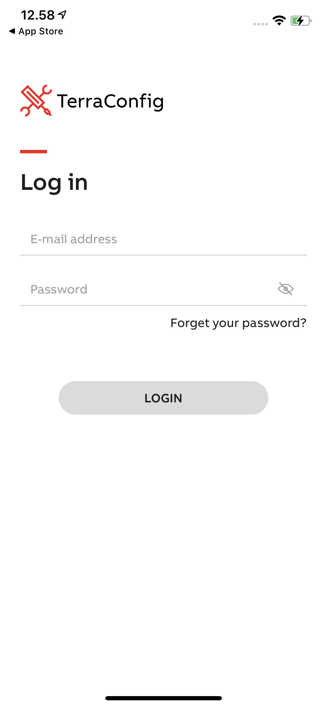

---

# Step 2

Once logged in you will need to pair to the device (if paired already continue to step 4) click on
the "Connect Charger" button

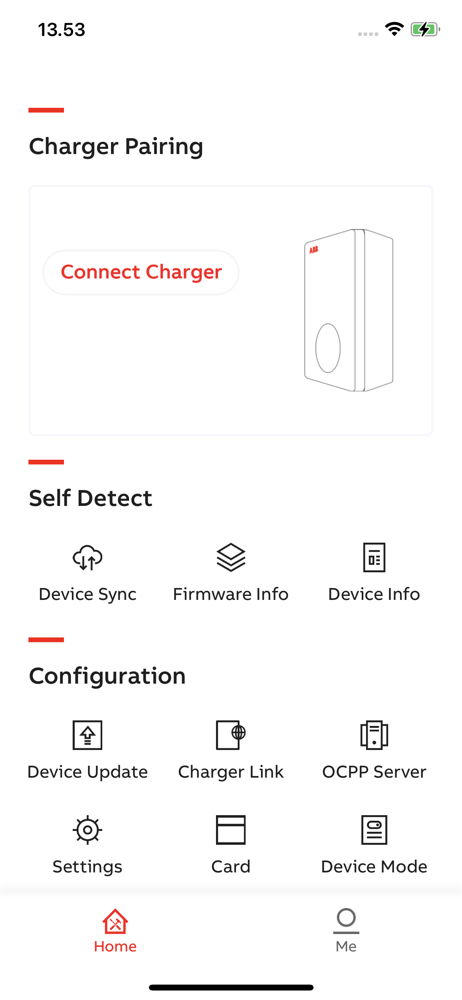

---

# Step 3

Then you should see a screen where you can select from multiple charges go ahead and click on the
charger you are trying to connect to, after which you will need the `pin code` provided by the
customer in the `Charger Sync` application under the `Me > My Device` section located at the bottom
of the screen

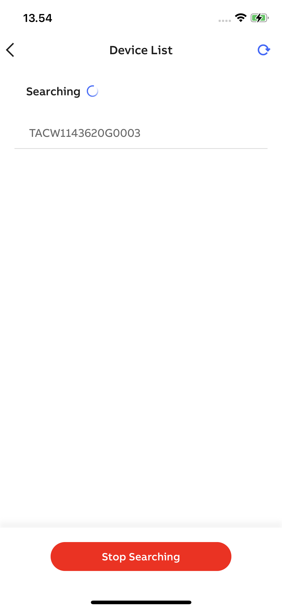

---

# Step 4

Once paired it's necessary to check if the device is properly connected to a network click on
the `Charger Link` button

---

# Step 5

Verify that the device is connected to a `LAN` or `Wifi` network then head back to the main menu

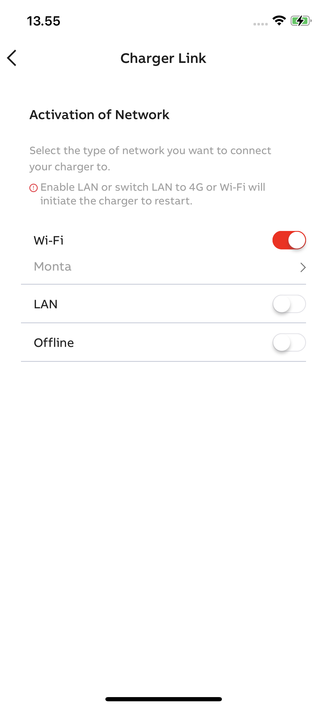

---

# Step 6

At the main menu you will continue to the `OCPP Server` section by clicking on the button

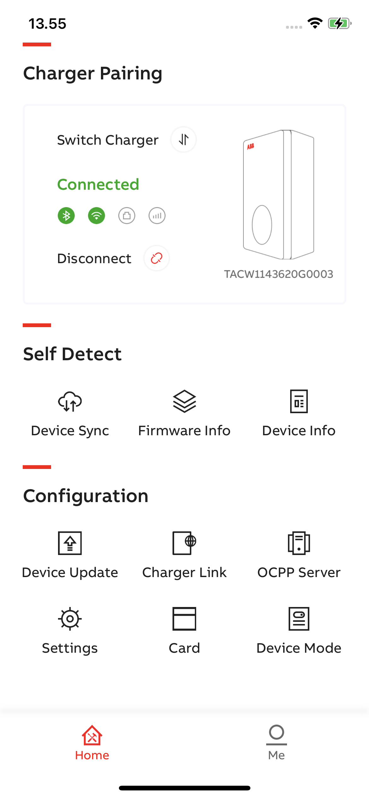

---

# Step 7

Once you arrive at the `OCPP` section you will see an empty list and above that list you should see
the `Locally Cache Server +` go ahead and click on the `+` button

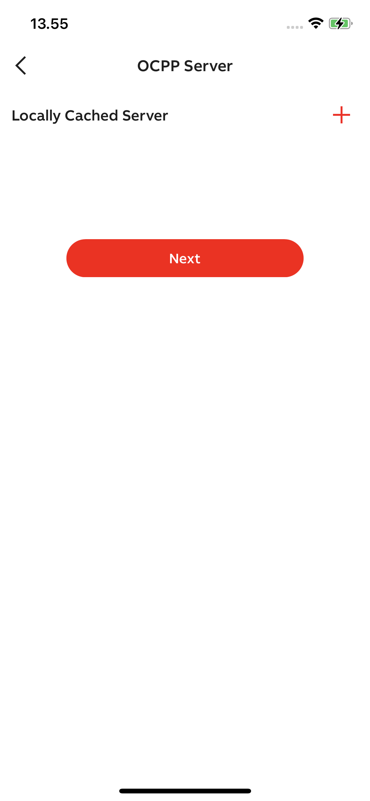

---

# Step 8

From there you will need to select the list item with the value `https://ocpp.monta.app:443` and
click on the download button after which you should be taken back to the OCPP menu

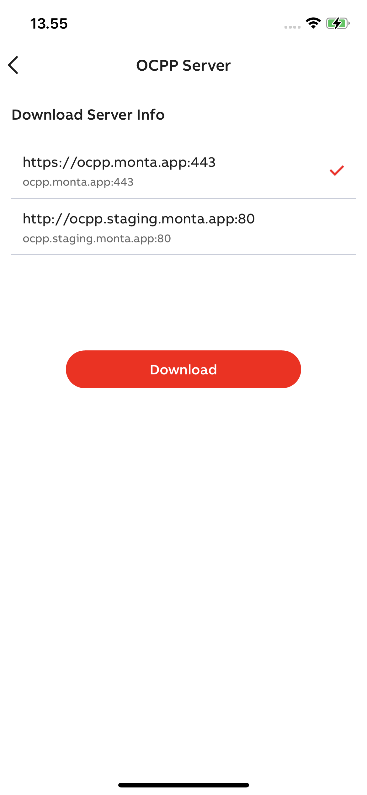

---

# Step 9

Now the list should no longer be empty and you should have at least one item in the list that
corresponds to the following value: `https://ocpp.monta.app:443` click next to continue

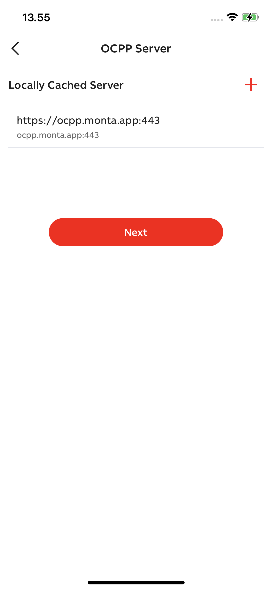

---

# Step 10

Once you arrive at the configuration menu you might need to toggle the `Enable External Access`
toggle switch after which you should see a small menu pop up where you can click on server info. Go
ahead and click on it

**Note: At this point you should save the Serial number in this section as it's the value that you
will need to register your device with Monta**

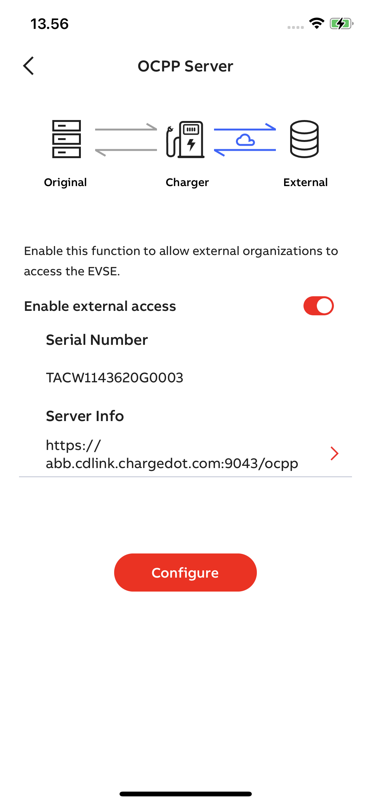

---

# Step 10

A small menu should pop up from the button where you can select the configuration you downloaded
earlier. Go ahead and click on the configuration that says `https://ocpp.monta.app:443`

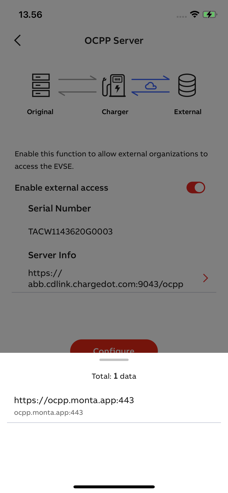

---

# Step 11

Once selected you should be able to click on `Configure` or `Ok` and if everything goes okay you
will see the following 3 checkmarks. If any error occurs please go to the main screen and retry from
step 5. Otherwise take a screenshot of the error and forward it to support.

But if everything goes correct you should be able to go back to the main menu and continue the
registration on the Monta app using the OCPP provider

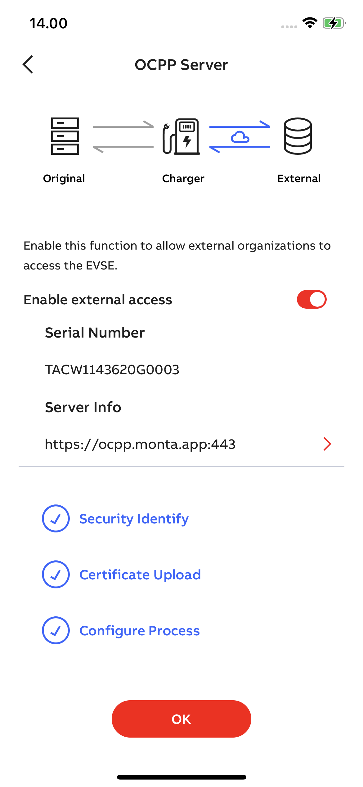

---