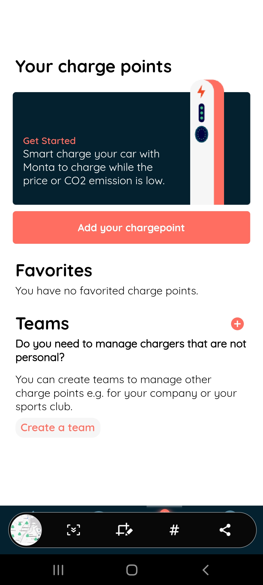

### Step 1

After logging in you should be presented with a tab bar in order to add a charger you'll need to continue to the `Charger` tab.

---

### Step 2

Once at the chargers tab you will see a big button that says `Add your chargepoint` go ahead and click on that to continue

---

### Step 3

After which you should land on this screen please fill out all the info on the form

---

### Step 4

After completing the form you should be able to click the `Add chargepoint screen` button and if everything goes right you're done and will
be taken to the `integrations` screen.

---

### Next Guide

#### [Charge Point Integration Guide](cp_integration_guide.md)