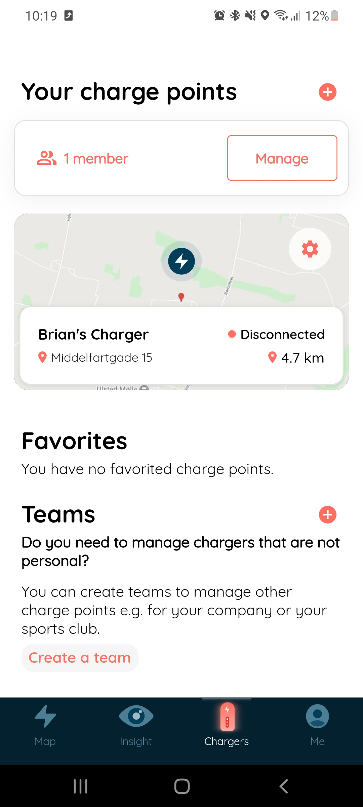
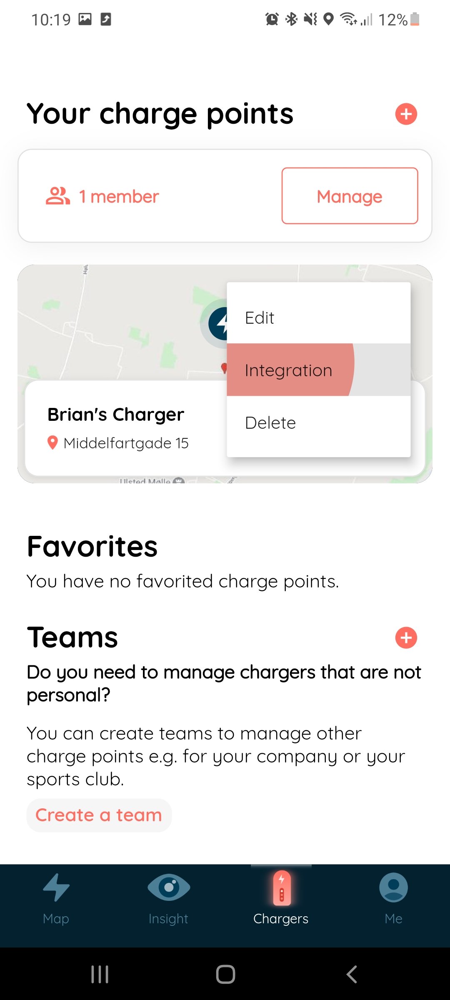
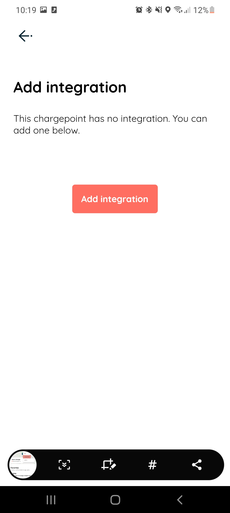

### Step 1

After having successfully created your charger (see [Charger Creation Guide](cp_creation_guide.md) if you haven't created one yet) you
should be able to create/edit an integration by selecting the cog icon on the charger itself

---

### Step 2

Upon clicking the small cog you should be presented with a small drop down menu where you can select `Integration` go ahead and click it.

---

### Step 3

If everyone goes right you should arrive at this page where you can click the `Add Integration` button or if you have an existing
integration it will say `Replace Integration` click on either button to continue the process.

---