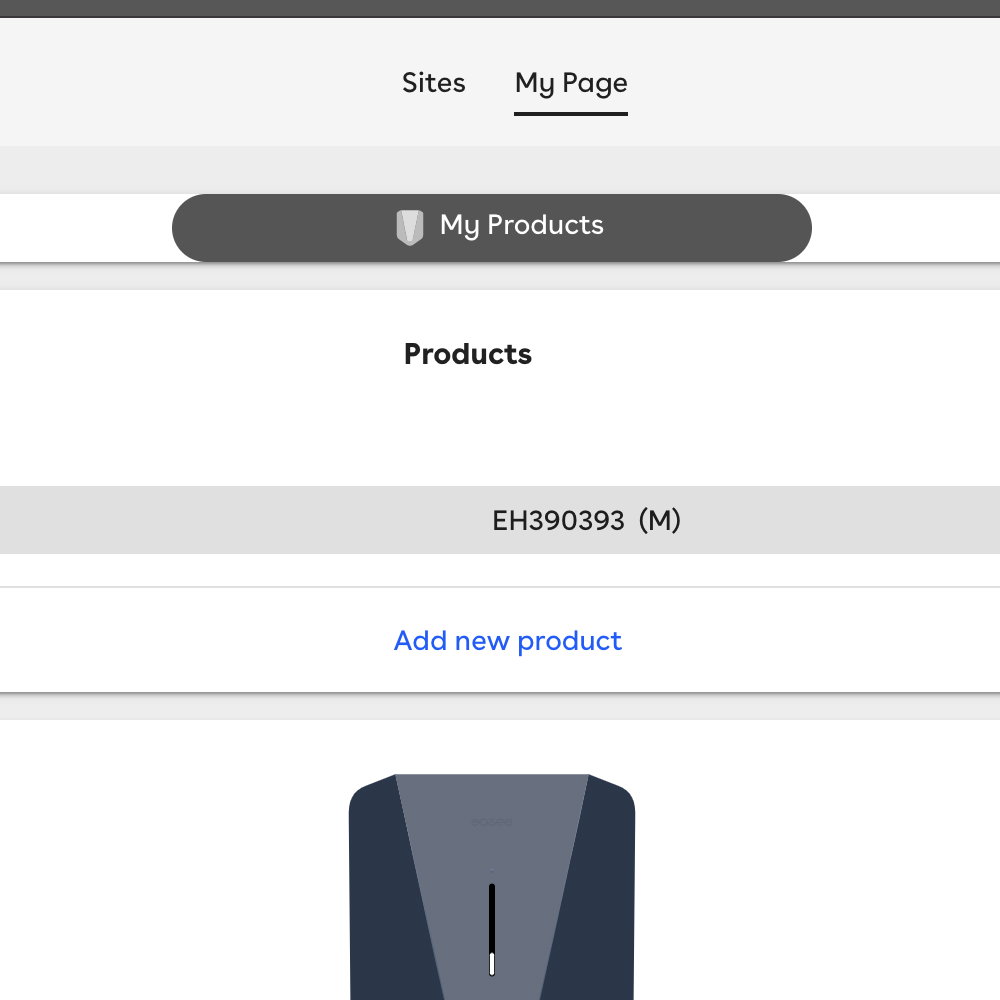

### Step 1

Login Into [Easee Cloud](https://easee.cloud/)

---

### Step 2

Once logged in you'll arrive at the `My Page` section you should then click the `Sites` tab

---

### Step 3

At the `Sites` tab you should see at the very least 1 site setup (which should be the default site)
if there are multiple sites then you should locate the site that is associated with the charger that
you want to pair to Monta's services.

---

### Step 4

Once you are in the sites settings you'll see a list of settings that can be changed the one we're
interested in today is the `Operator` section go ahead and click on that

---

### Step 5

Once clicked upon you should be presented with the unpair button, it is possible that it be on the "
pair" state but this is fine and you can continue to the next step

---

### Step 6

It should now be possible to select Monta as the operator from the down drop menu

---

### Step 7

Locate the "Monta" operator in the drop down and click "Pair"

---

### Step 8

Once you see the following message below the charger should start connecting to our services and you
can continue to pair the charger in the Monta App making sure to select the "OCPP" method. Please be
sure to note down the Serial number as that is what will be used to pair the device.

