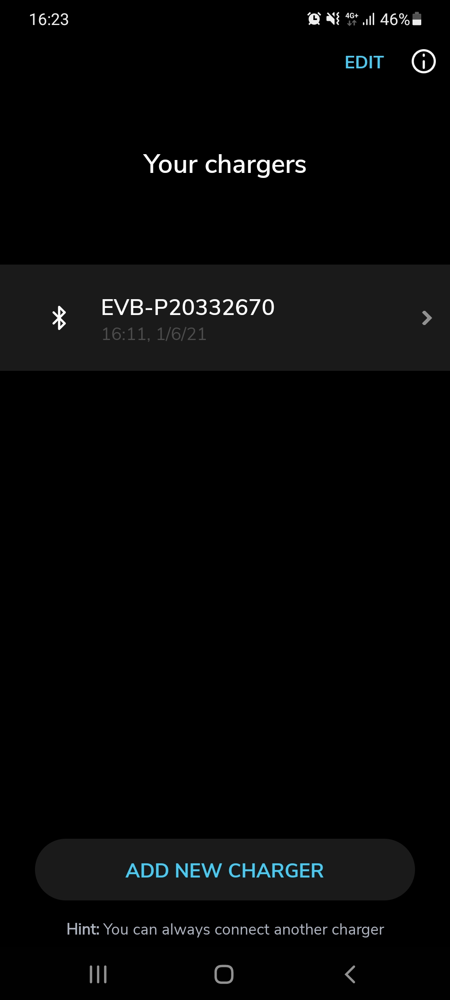
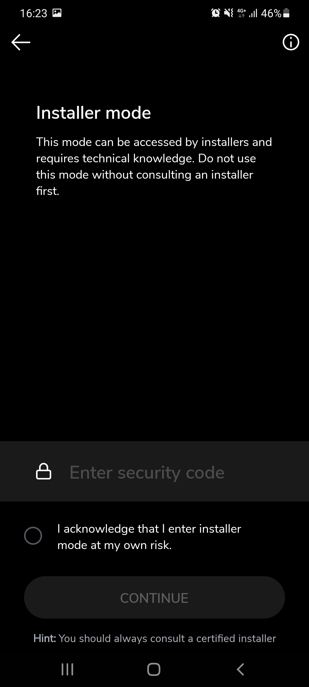
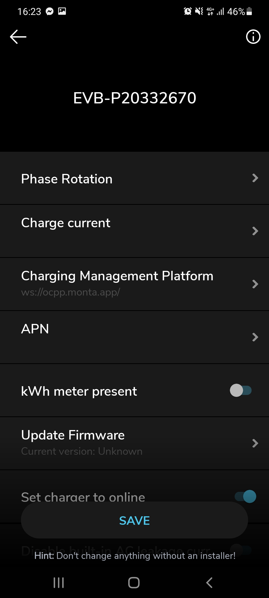
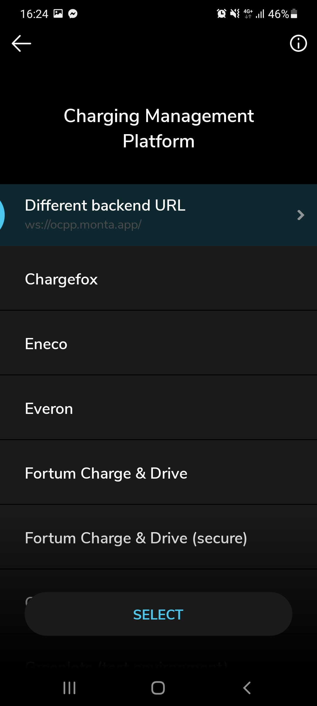
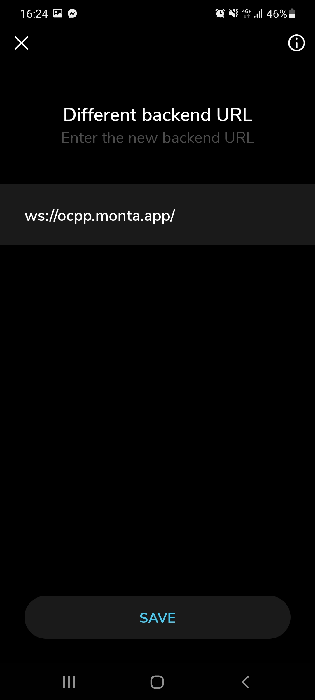

### Before

Install the mobile app

[Android App](https://play.google.com/store/apps/details?id=com.evbox.evboxconnect)  
[iOS App](https://apps.apple.com/us/app/evbox-connect/id1449592075)

### Step 1

Find and connect your charger (Note: Save the Charger Serial number at this point it will be used
later in the pairing process should look something like `EVB-XXXXXX`)

---

### Step 2

Once connected to the charger you will need to head into `Installer Mode` click the button at the
bottom of the screen

---

### Step 3

Once you arrive to this screen you will be prompted to enter the `Security Code` this should come
with your chargers installation typically located on a big cardboard cutout, enter the code and
continue.

---

### Step 4

After entering installer mode you will see a menu the area where we need to enter is
called `Charging Manager Platform` go ahead and click on that button

---

### Step 5

Upon entering the `Charging Manager Platform` section you will be presented with a list of options
you should select the first option `Different Backend URL`

---

### Step 6

In the `Different Backend URL` you will be able to enter the Monta Server URL `ws://ocpp.monta.app/`
once complete click on `Save` and be sure to restart your charge point for any changes to take
place.

Once the charger is restarted go ahead and continue the rest of the setup from the Monta app.

