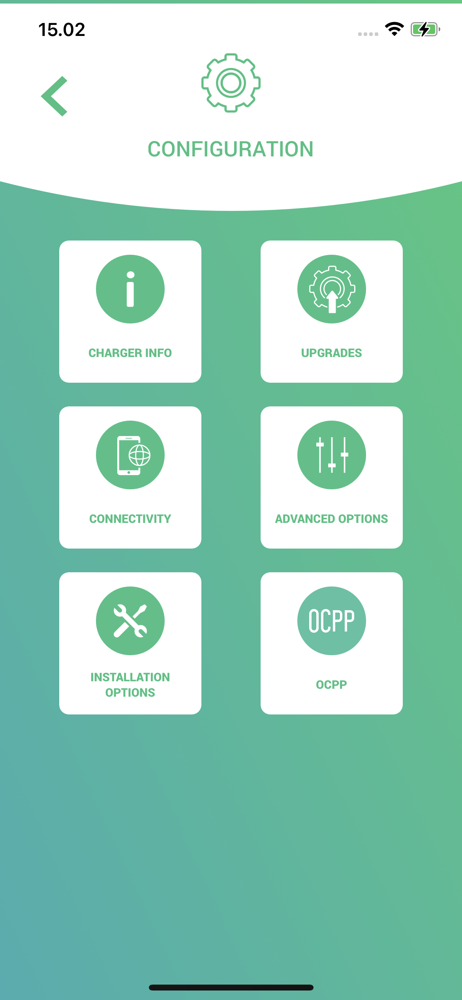

### Before

Install the mobile app

[Android App](https://play.google.com/store/apps/details?id=com.wallbox)  
[iOS App](https://apps.apple.com/tr/app/wallbox/id1188288011)

(Can also be done from the web if the Device is connected to WiFi)

If the device isn't connected to WIFI you must be at least 10 feet from the device to continue the
setup.

**Important: Before starting this setup you will need a monta serial number from the App you can get
that by going into the `Charge Point Integration` and creating a `Wall Box Puslar OCPP` integration
where you should be present with a serial number**

### Step 1

Login with the user credentials

---

### Step 2

Select the charger you want to pair to Monta's services

---

### Step 3

Once you have selected the charger wait until the connection is made, the screen background should
go from purple to green when this occurs. Once that is ready you should click the settings Icon at
the top right.

---

### Step 4

Once in the settings menu you will need to check to see if the WIFI is connected by going
into `Connectivity`

---

### Step 5

In the `Connectivity` menu make sure that the `WIFI` toggle is on and that you are connected to a
network if not select a network from the `Choose Network` screen and once connected head back to
the `Settings` menu

---

### Step 6

Once you're at the `Settings` menu again we will need to write down the `Serial number` head
into `Charger Info`

---

### Step 7

Here you will find the `Serial Number` above the label make sure to write it down as we will need it
later. Head back to the `settings` menu

---

### Step 8

Now you will go into the `OCPP` section if you don't see this in your menu it is because you are not
connected to the device make sure to check your connection if so.

---

### Step 9

Once you reach the OCPP menu you will need to enable the toggle switch and fill out the forms

`url: ocpp.monta.app`
`charge point identity: {montaSerialNumber}`

be sure to read and accept the terms and click save and you should be taken to the main menu

---

### Step 10

From the main menu you should be able to reconnect to the charging device and see the OCPP connected
icon that will confirm that you have successfully paired your device

---