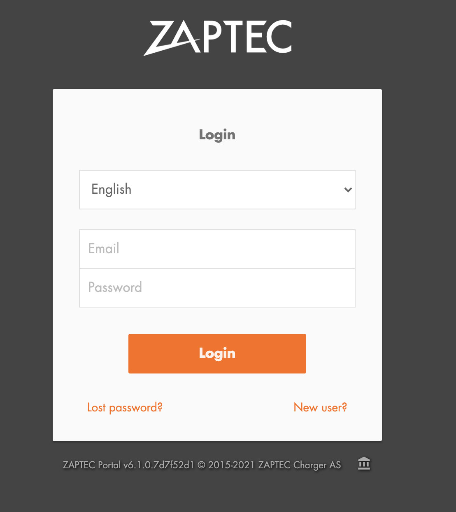
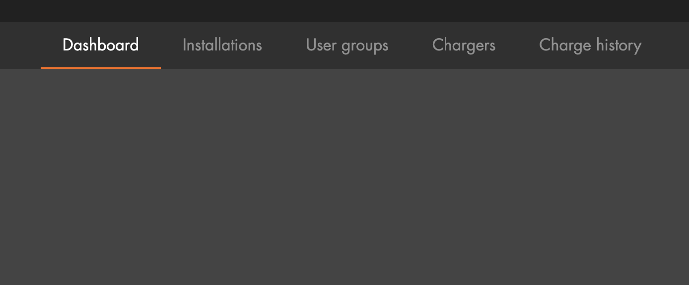
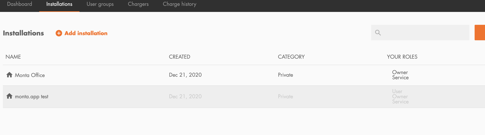
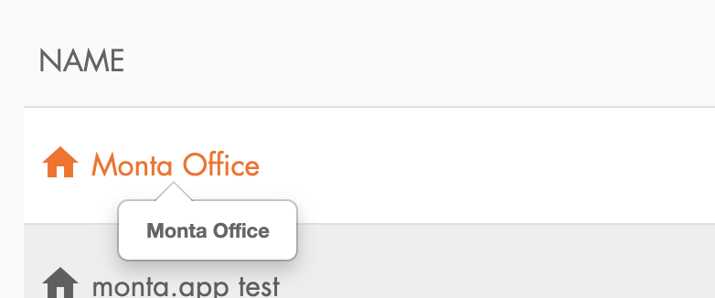
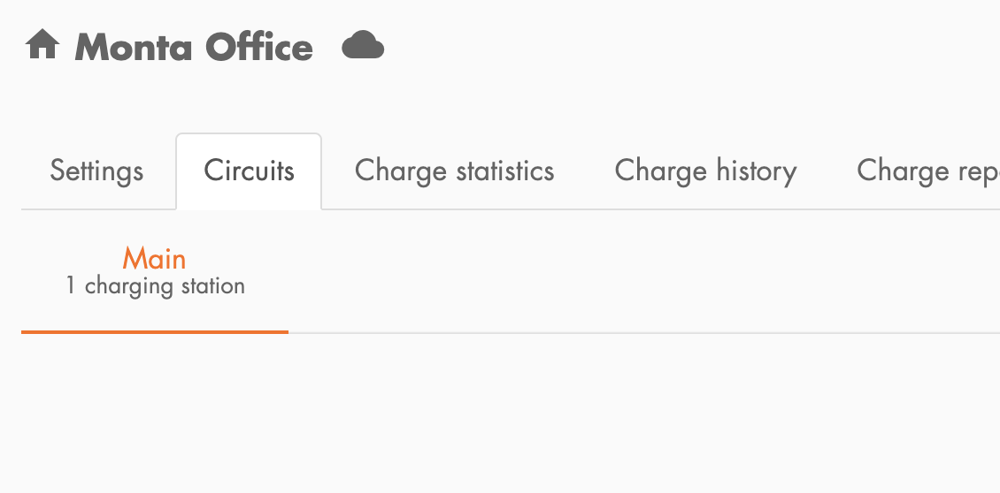
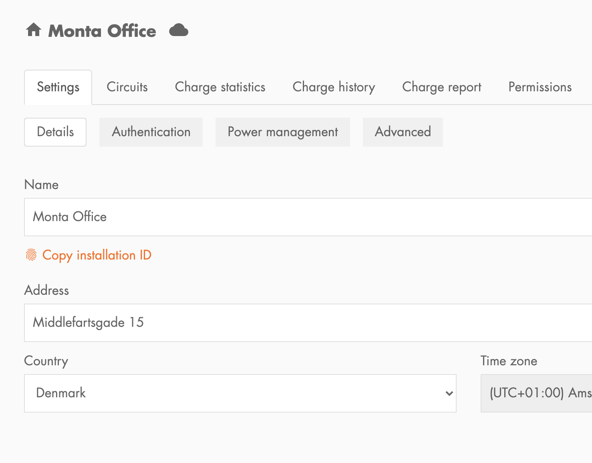
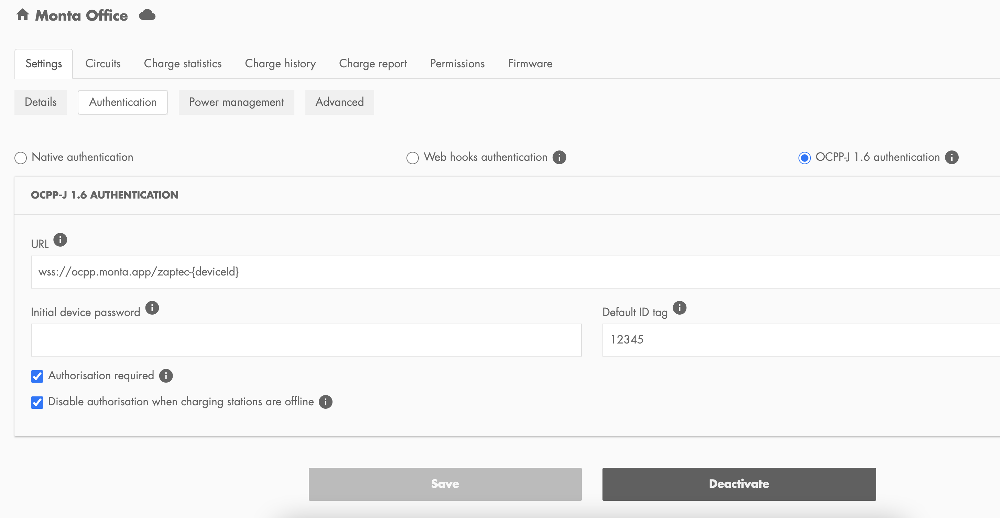

### Step 1

Login Into [Zaptec Portal](https://portal.zaptec.com/)

### Step 2

Once logged into the dashboard head over to the `Installations` tab

### Step 3

From the installations tab select the installation site that you want to setup with Monta (please
note that we currently only support site wide installations) if a customer has different charge
points that they don't want to setup via Monta a seperate site must be created in that case.

### Step 4

Select the correct site

### Step 5

Once in the site page you will want to click on the `Settings` tab

### Step 6

Once you reach the settings tab you will want to click on the `Authentication` tab under the primary
tab bar

### Step 7

After reaching the `Authenthication` tab the user must now select the `OCPP-J 1.6 authentication`
option and they will see a fillable form like the one below the only field that must be filled in us
the URL below it is very important that it is entered exactly as below.

`URL: wss://ocpp.monta.app/zaptec-{deviceId}`

### Step 8

Once the `URL` value is filled all that is left is to click save and the setup is complete the user may now finish the setup via the Monta app

The serial number they should use for registering should be `zaptec-{SerialNumber}` without the {}